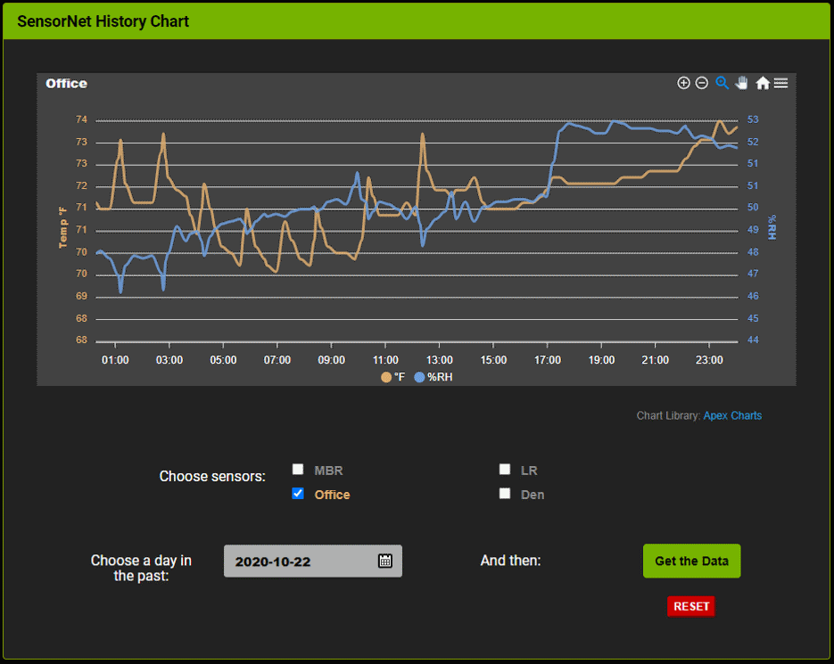
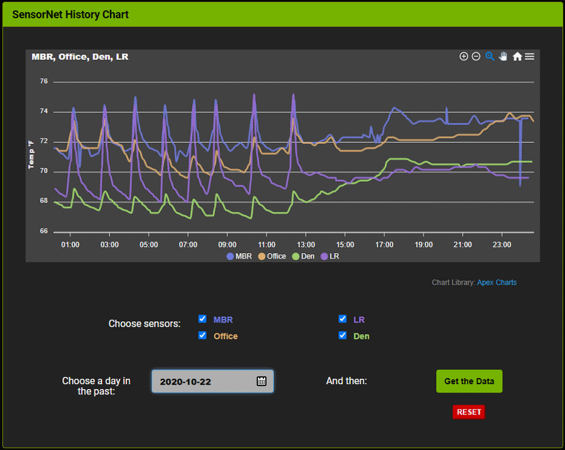
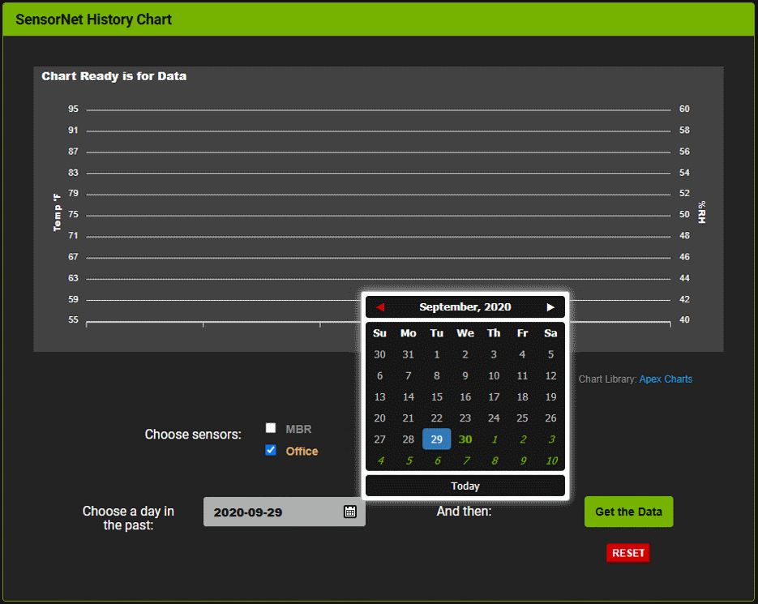

# SensorNet Chart

An application that is part of the [SensorNet](https://github.com/jxmot/sensornet) project. It retrieves sensor data from the SensorNet server and creates graphs using [Apex Charts](https://github.com/apexcharts/apexcharts.js).

## Background

I've been running SensorNet in my home for about 3 years and collecting all the sensor data. For charting the data I had been exporting it from the database and importing the data into a spreadsheet. And then graphing it there. Not ideal, but it did what I needed. 

Every so often I would search for a JavaScript charting plugin that I could use <i>successfully</i>. I won't bore you with the details of every plugin I investigated. But I did write testing code for each as part of their evaluation.

## Dependencies

This client requires the following:
* A running [SensorNet Server](<https://github.com/jxmot/node-dht-udp>). It is a Node.js application that collects sensor data, stores it, and forwards it to connected clients.
   * Which requires [SensorNet Devices](<https://github.com/jxmot/esp8266-dht-udp>) to provide data
   * Enough data to chart. 
* Shared resources (js, css) with the [SensorNet Client](<https://github.com/jxmot/client-dht-udp>) application. Both utilize [Socket.io](<https://socket.io/>) for communication with the SensorNet Server. 

## Live Demonstration

A *live* demonstration can be seen at [????](). And [SensorNet Live]() can also be viewed.

## Running the Application

Select one or more sensors and then choose a date in the past. Click the "Get the Data" button and the data will be displayed.

  

## GUI Design

<i>under contstruction</i>

### Color Scheme

<i>under contstruction</i>

### Operation

<i>under contstruction</i>

## Selecting Sensors

One or more sensors can be selected. Each is color-coded and when its graph is drawn the temperature line color will match.

  

When a single sensor selected the humidity line will use an alternate color.

  

Each sensors is associated with its own color to make it easier to distinguish them.

  

## Selecting a Start Date

When a date is selected from the picker and *epoch* value is calculated that represents 00:00 on the day chosen. The server will use that time stamp to search for sensor data.

  

After the data is charted you can:
<ul>
    <li>Zoom in or out by dragging through the chart along the X-axis.
        or use the buttons at the top and right of the chart.</li>
    <li>Pan the chart by clicking a button at the top and right 
        of the chart.</li>
    <li>Export SVG, PNG, or a CSV file containing chart data.</li>
    <li>Enable or disable specific lines by clicking on the corresponding
        colored dot and legend at the bottom of the chart.</li>
</ul>

Details can be found in the [Apex Charts](https://github.com/apexcharts/) documentation and demonstrations.

## How it Works

<i>under contstruction</i>

## Plug-in Modifications

<i>under contstruction</i>

### Apex Chart

<i>under contstruction</i>

### Zebra Datepicker

I chose the [Zebra Datepicker](https://github.com/stefangabos/Zebra_Datepicker) because of the features and a very good(*i.e. working*) demo page. I also like that it has 3 themes to choose from. I also browsed the source and it's commented very well and is easy to follow.

I decided that the *Bootstrap* theme would work the best because I was already using Bootstrap here and on *SensorNet Live*. 

---

