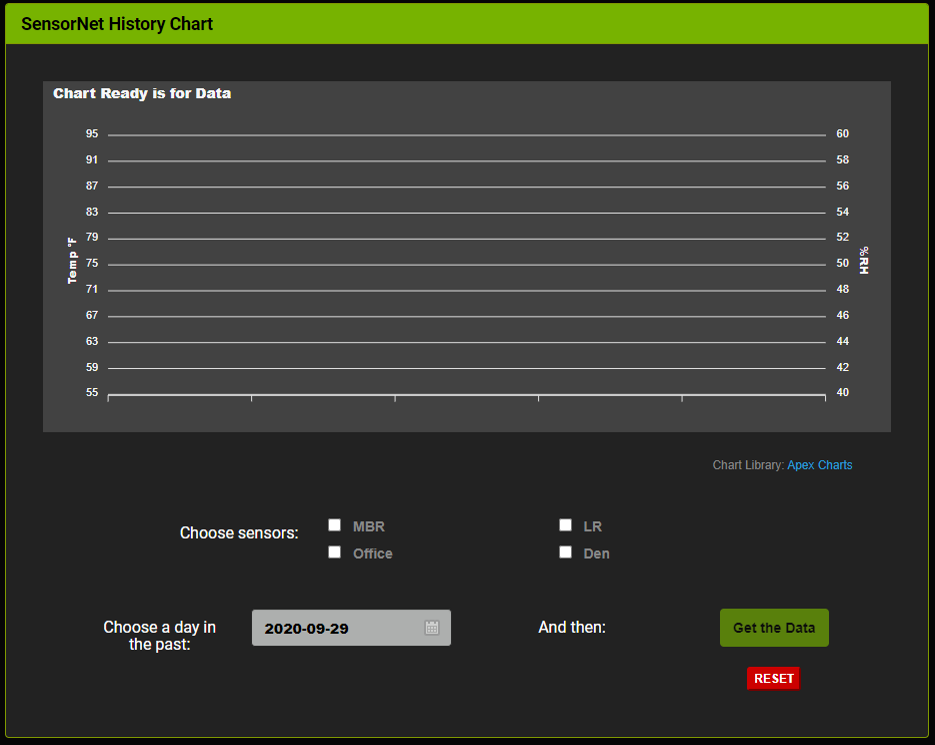
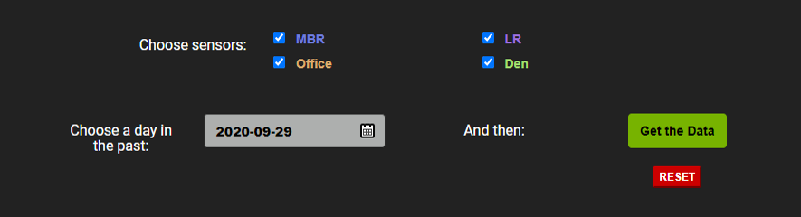

# SensorNet Chart

An application that is part of the [SensorNet](https://github.com/jxmot/sensornet) project. It retrieves sensor data from the SensorNet server and creates graphs using [Apex Charts](https://github.com/apexcharts/apexcharts.js).

## Background

I've been running SensorNet in my home for about 3 years and collecting all the sensor data. For charting the data I had been exporting it from the database and importing the data into a spreadsheet. And then graphing it there. Not ideal, but it did what I needed. 

Every so often I would search for a JavaScript charting plugin that I could use <i>successfully</i>. But I had some requirements to satisfy:

<ul>
    <li>Open Source, with the following guidelines -</li>
    <ul>
        <li>It's "active", there must be evidence of recent development and
        the closing of issues.</li>
        <li>Clean Code, and it should be appropriately commented.</li>
        <li>Documentation must be up to date with development efforts
        and <i>readable</i>.</li>
        <li>The author(s) are active in responding to issues.</li>
    </ul>
    <li>Any dependancies are also subject to the same requirement(s).</li>
    <li>Must not require any backend code or running software in order
    to operate normally.</li>
    <li><strong>FREE!</strong> A <i>usable</i> plugin without any costs to
    use it either commercially or non-commercially.</li>
    <li>Needs to be adapatble for charting <i>live data</i>.</li>
    <li>And it must look <i>good</i>.</li>
</ul>

I won't bore you with the details of every plugin I investigated. But I did write testing code for each as part of their evaluation.

## Running the Application

Select one or more sensors and then choose a date in the past. Click the "Get the Data" button and the data will be displayed.

  

### Selecting Sensors

One or more sensors can be selected. Each is color-coded and when its graph is drawn the temperature line color will match.

When a single sensor selected the humidity line will use an alternate color.

  

After the data is charted you can:
<ul>
    <li>Zoom in or out by dragging through the chart along the X-axis.
        or use the buttons at the top and right of the chart.</li>
    <li>Pan the chart by clicking a button at the top and right 
        of the chart.</li>
    <li>Export SVG, PNG, or a CSV file containing chart data.</li>
    <li>Enable or disable specific lines by clicking on the corresponding
        colored dot and legend at the bottom of the chart.</li>
</ul>

## How it Works

## Plug-in Modifications

### Apex Chart

### Zebra Datepicker

